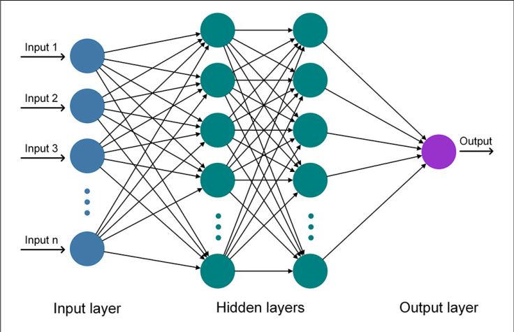

# Simple Neural Network in C++



## Overview

This project is a **simple multi-layer artificial neural network (MLP)** implemented in C++.  
It aims to help understand the basic concepts of neural networks and how data propagates through different layers using the **Sigmoid activation function**.

---

## Features

- Build a neural network with any number of hidden layers.
- Customize the number of neurons in each layer.
- Manually input weights and biases for every neuron.
- Compute the final outputs after feed-forward propagation.
- Use the Sigmoid activation function for neurons.
- Modular design with a `Layer` class handling all layer operations.

---

## Project Structure

```
.
├── Layer.h           # Layer class declaration and function prototypes
├── Layer.cpp         # Layer class function implementations
├── main.cpp          # Main program execution
└── README.md         # This README file

```

---

## How to Use

1. **Compile:**

   Use the following command to compile the project with g++:

   ```bash
   g++ main.cpp Layer.cpp -o neural_network
   ```

2. **Run:**

   ```bash
   ./neural_network
   ```

3. **Input Instructions:**

   - Enter the number of input neurons.
   - Enter the input values.
   - Enter the number of hidden layers.
   - For each hidden layer, enter the number of neurons, then enter weights and biases for each neuron.
   - Enter the number of neurons in the output layer, then enter their weights and biases.
   - The program will display outputs of each layer and the final network output.

---

## Future Improvements

- Support for other activation functions like ReLU and Tanh.
- Implement training via Backpropagation.
- Load network parameters from a file instead of manual input.
- Develop a graphical user interface (GUI).
- Optimize performance with specialized libraries.

---

## Author

**Mohamed Abdullah**

- GitHub: [mohamedabdullah999](https://github.com/mohamedabdullah999)
- LinkedIn: [Mohamed Abdullah](https://www.linkedin.com/in/mohamed-abdullah-1890b02ab/)

---

# Artificial-Neural-Network
